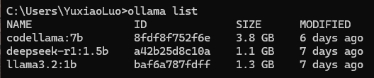

# Get Started with Ollama

This tutorial inroduces how to use Ollama with the Command Line Program.

- Windows OS uses [Command Prompt](https://www.geeksforgeeks.org/what-is-a-command-prompt/)
- MacoS uses [Terminal](https://www.freecodecamp.org/news/command-line-for-beginners/) 

This tutorial assume you use Windows OS. This [guide](https://zwbetz.com/mac-to-windows-command-line-mappings/) provides a mapping of command syntac between Windows and Mac.

## Step 1: Install Ollama

First, download and install Ollama from the official [website](https://ollama.com/download). Once the download is complete, install the Ollama application like you would do for any other application.

## Step 2: Verify Installation
After the installation is complete, you can verify it by running:

```sh
ollama --version
```

## Step 3: Download the model of you interest 

### List of open-source models
Here is a library of the available models on Ollama: https://ollama.com/search. All the models are open-source. This tutorial chooses the currently hottest open-source model [deepseek-r1](https://ollama.com/library/deepseek-r1). Here is a brief introudction of it:

> DeepSeek's first-generation of reasoning models with comparable performance to OpenAI-o1, including six dense models distilled from DeepSeek-R1 based on Llama and Qwen.

### Choose a distilled model based on your machine
Because of the limited CPU on my laptop, I'm demonstrating the smallest distilled model (named: `deepseek-r1:1.5b`) with 1.78 billion parameters, which has a size of roughly 1.1GB. 

Distilled model (i.e., student model) is created via fine-tuning against several dense models widely used in the research community using reasoning data generated by DeepSeek-R1 (i.e., teacher model). The evaluation results demonstrate that the distilled smaller dense models perform exceptionally well on benchmarks. 

- `deepseek-r1:1.5b` is fine-tuned based on `qwen2` model developed by Alibaba. 
- If you have better computer, you can try the `deepseek-r1:8b` model, which comes with 8.03 billion parameters and a size of 4.9 GB. `deepseek-r1:8b` is fine-tuned based on `llama` model developed by Meta. 

### Pull the model and check it
To pull the model from ollama and install it on your local machine

```sh
ollama pull deepseek-r1:1.5b
```

Now you can check the list of model on your local machine

```sh
ollama list
```

For example, on my computer, it shows:


### Step 4: Run the model

Enter the command below to initiate the AI model

```sh
ollama run deepseek-r1:1.5b
```

Now you can send any message to it and see its response. Please note that the processing time on different computers may vary depending on the machine specs.

Let me input:
>"I'm a business college freshman, can you suggest how I should choose my major?"

Here is DeepSeek-R1's response:
> Okay, so I'm a business student and I'm kind of torn between two different majors. One is Marketing and the other
is Finance. Hmm, where do I even start?
>
>First off, what's the difference between these two fields? I think Marketing has to do with selling products or
services, like how you promote stuff online or through ads. On the other hand, Finance deals more with money
management, accounting, and investments. But wait, they both seem pretty important for a business school.
>
>I remember hearing that marketing is good if I want to sell things. But then there's this thing about being an expert in customer
interactions. How does that translate into my education? Maybe taking courses on branding, advertising, or sales techniques would
help me get that edge over the more financial side of finance.
>
>But what are the pros and cons of each major? For Marketing, I guess it could lead to a stable job with good salaries, but maybe
not as much growth opportunities. And if I end up in marketing, am I open to a lot of different industries later on? That might
be a plus because businesses grow everywhere.
>
>On the other hand, Finance seems more career-oriented. If I go into finance, I can work in banking or investment, which are both
very growing fields. But with that growth comes uncertainty and maybe higher risk if things don't go as planned. Plus, you often
need to know a lot of numbers and financial models to succeed.
>
>I also think about the job market. Are there more opportunities for marketing jobs or finance jobs? I should check some reports
from the U.S. Bureau of Labor Statistics or something like that. Maybe recent trends in industry growth could help me decide
which major aligns better with what's happening right now.
>
>Another thing is how I plan to take courses. If I focus on Marketing, I might get a solid foundation in all areas, but if I
switch to Finance, I might miss out on some key marketing skills that could be useful. So maybe I can look for courses that
bridge the two fields or have both Marketing and Finance components.
>
>What about internships? How much experience do I need before applying to schools? I think a few good internships would give me a
head start. If I have one in finance, that might open doors in financial roles, but if I'm into marketing, maybe I can find
opportunities in sales or entrepreneurship elsewhere.
>
>Maybe I should also consider the personal interests and strengths. Do I enjoy working with numbers more than interacting with
people? Or is it more about selling stuff? It's possible my passion could shift once I realize which major aligns better with
what I want to do.
>
>I also wonder if any part of each major overlaps. Like, both marketing and finance require strong analytical skills, so maybe
that's a common ground. That might make me feel more confident in applying to either program after all.
>
>Wait, but how do I weigh these pros and cons against each other? If I choose Marketing, I can explore various industries, which
seems like a good path for growth. If I go to Finance, the career opportunities seem more specialized but with higher earning
potential. Maybe I should research both fields' job market stats and see where my interests lean.
>
>I also need to think about why I'm interested in business at all. Is it just about the degree itself or do I want to contribute
to specific areas that I find exciting? Understanding this will help me choose a major that not only prepares me for the
classroom but also aligns with future goals.
>
>Another thought: maybe take some introductory courses in both Marketing and Finance to get a better sense of what each requires.
That way, I can make an informed decision without getting too confused by textbooks or classes that aren't necessary yet.
>
>In summary, my options are:
>
>1. Focus on Marketing: Build strong customer interaction skills, relevant for >selling and understanding different industries.
>2. Focused on Finance: Learn financial management, growth opportunities, >numbers-oriented work.
>3. Consider taking courses in both areas to find a balance or overlap that suits me >better.
>4. Research the job market to see which major offers more stability and growth >potential.
>5. Evaluate personal interests and how they align with my long-term goals.
>
>I think I need to start by doing some research on the U.S. labor statistics for each field, check out some introductory courses
in both areas, and maybe talk to advisors or professors if they're interested in either major. That way, I can make a more
informed decision than just guessing.
>
>Based on your thought process, here's a structured plan to help you choose between Marketing and Finance as a business major:
>
>### 1. Understand the Core Differences:
>- **Marketing**: Focuses on customer interaction, sales techniques, brand >management, and understanding various industries.
>- **Finance**: Deals with financial management, investment strategies, accounting, >and risk assessment.
>
>### 2. Explore Opportunities and Procs:
>- **Job Market Research**: Check U.S. labor statistics (e.g., from BLS) to find out >which field offers more stable or growing
>opportunities.
>- **Coursework**: Look for introductory courses that highlight both areas if >possible, allowing you to balance your interests
>with potential overlaps.
>
>### 3. Align with Personal Interests:
>- Reflect on whether your passion lies in interacting with people (Marketing) or in >financial management and analysis (Finance).
>- Consider how each major aligns with your long-term career goals and future >aspirations.
>
>### 4. Consider Academic Overlaps:
>- Both majors require strong analytical skills, so this overlap can be beneficial >for developing confidence across various roles.
>
>### 5. Make a Decision:
>- **Marketing**: If you want growth opportunities in selling and diverse industries.
>- **Finance**: If you prefer specialized roles with financial expertise and higher >earning potential.
>
>### Action Steps:
>1. **Research**: Use resources like the U.S. Bureau of Labor Statistics to understand job market trends.
>2. **Take Introductory Courses**: Identify courses that offer insights into both >fields if possible.
>3. **Consult Advisors/Professors**: Seek advice on aligning with your interests and >long-term goals.
>
>By taking these steps, you can make a more informed decision that aligns with your academic aspirations and future career plans.

You can provide more details if you need a more specific and organized plan.

### Step 5: Available commands in using the model

There are other commands available to use:
- `/show info`: Show details for this model
- `/show license`: Show model license
- `/show modelfile`: Show Modelfile for this model
- `/show parameters`: Show parameters for this model
- `/show system`: Show system message
- `/show template`: Show prompt template

If you are done using the model, you can quit the model:

```sh
\bye
```
### Others

- If you know Python, you can access these Ollama models via Python package `ollama`
- If you are interested in customizing an open-source model with System Prompt, you can create an Ollama `Modelfile` with instructions and model parameter tuning. Like a custom model on ChatGPT.
- If you don't like model interaction with Command Line, you can download third party UI software, such [Chatbox](https://github.com/Bin-Huang/Chatbox) and [LMStudio](https://lmstudio.ai/). 

## References
- How to set up and run DeepSeek R1 locally: https://www.datacamp.com/tutorial/deepseek-r1-ollama
- Ollama model file: https://github.com/ollama/ollama/blob/main/docs/modelfile.md
- How to prompt Code Llama: https://ollama.com/blog/how-to-prompt-code-llama