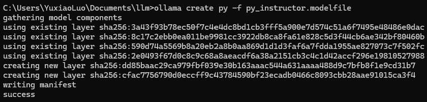
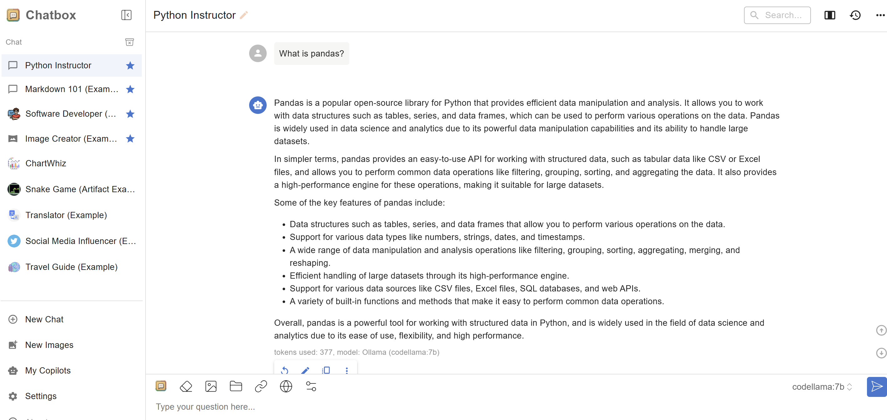

# Tutorial: build your custom AI with Ollama
## Author: [Dr. Yuxiao (Rain) Luo](https://github.com/YuxiaoLuo)

In this tutorial, we will use [Ollama](https://ollama.com/) to build a custom Python Instructor AI for your own use.

- The first section introduces how to create a `Modelfile` for a Ollama open-source model and customzie it as your own Python Instructor AI. 
- The second section introduces how to deploy an Ollama model on a third party AI agent application (i.e., ChatGPT type of App), [Chatbox AI](https://chatboxai.app/en). 

All the tools involved are open-source and free. If you haven't installed Ollama, please follow [this](https://github.com/YuxiaoLuo/AI_Intro/blob/main/tutorial_ollama.md) and install it first.

## Create custom GenAI model with Ollama model file

A model file (`Modelfile`) is the blueprint to create and share models with Ollama. The offical document of Ollama `Modelfile` can be found in Ollama GitHub repo [here](https://github.com/ollama/ollama/blob/main/docs/modelfile.md).

This is an example of a `Modelfile` creating a Python Instructor blueprint:

```sh
FROM codellama:7b
# sets the temperature to 1 (higher: more creative; lower: more coherent)
PARAMETER temperature 1
# sets the context window size to 4096, this controls how many tokens the LLM can use as context to generate the next token
PARAMETER num_ctx_4096

# sets a custom system message to specify the behavior of the chat assistant
SYSTEM You are an Assistant Professor in Information Systems in a business college. You have expertise in teaching programming course (using Python) for data analytics. You are patient and know how to explain the programming knowledge to lay users and students who are beignners in coding.
```

In this `Modelfile`, we are customizing the [codellama](https://ollama.com/library/codellama) as our personal Python Instructor.

> Code Llama is a model for generating and discussing code, built on top of Llama 2. It’s designed to make workflows faster and efficient for developers and make it easier for people to learn how to code. It can generate both code and natural language about code. Code Llama supports many of the most popular programming languages used today, including Python, C++, Java, PHP, Typescript (Javascript), C#, Bash and more.

If you are interested in other fields, here is brief list:
1. Finance, economics, trading: [Plutus](https://ollama.com/0xroyce/plutus) is a fine-tuned version of the LLaMA-3.1-8B model, specifically optimized for tasks in finance, economics, trading, psychology, and social engineering. 
    - `ollama run 0xroyce/plutus`
2. Accountancy: [Accountant](https://ollama.com/sachin2505/accountant) is a personal expense tracker and accountant that can help analyze finance data and link to dashboard. This is a model built on the 6.74B Llama 2
    - `ollama run sachin2505/accountant`
3. Marketing: [marketingexpert](https://ollama.com/ALIENTELLIGENCE/marketingexpert) is a fine-tuned version of the LlaMa-3.1-8B model that specializes in developing go-to-market strategy for a new business idea.
    - `ollama run ALIENTELLIGENCE/marketingexpert`

### Step 1: Create the `Modelfile`

Navigate to a folder (e.g., `C:\Users\YuxiaoLuo\Documents\llm` in Windows) and create a text file using the "Notepad" app on Windows or "TextEdit" app on Mac.

Paste the text below to the txt file and name it as "py_instructor.modelfile".
>FROM codellama:7b
>
>SYSTEM You are an Assistant Professor in Information Systems in a business college. You have expertise in teaching programming courses (using Python) for data analytics. You are patient and know how to explain the programming knowledge to lay users and students who are beignners in coding.

### Step 2: Create your custom model with the `Modelfile`

Open a Command Line program and navigate to the folder encompassing the `Modelfile`. For example, use `cd Documents\llm` in Windows and `cd ~/Documents/llm` in Mac.
- `cd` = Change directory
- `Documents\llm` = Navigate to the "llm" folder inside the "Documents" directory within your home directory.

Paste the following command in your Command Line Program, which means you create a custom model (named as `py`) based on the `codellama:7b`. 

```sh
ollama create py -f py_instructor.modelfile
```

You will see the following output in Command Line window.



### Step 3: Run your custom model in Ollama

```sh
ollama run py
```

Try asking these questions:
1. Show me 2 examples of pulling columns in pandas.
2. What are the popular web scraping tools?

## Create custom GenAI model with third-party UI

There are many third-party developed UI to use Ollama. These UIs are more user-friendly than Command Line program. I'm currently using Chatbox AI.

### Step 1: Download Chatbox app or use its Web App

I'm using its Web App via this link: https://web.chatboxai.app.

### Step 2: Connect Chatbox to remote Ollama service

Follow the [official guide](https://chatboxai.app/en/help-center/connect-chatbox-remote-ollama-service-guide) to set up remote Ollama service, especially focusing on the part of "How to Configure the Remote Ollama Service?".

#### Reminders
1. You may need to allow the Ollama service port (default 11434) through your firewall, depending on your operating system and network environment.
2. To avoid security risks, do not expose the Ollama service on public networks. A home WiFi network is a relatively safe environment.

### Step 3: Use Ollama model in Chatbox chatwindow

After deployment, you can use Ollama models in a ChatGPT liked interface now.



### References

- How to Connect Chatbox to a Remote Ollama Service: A Step-by-Step Guide: https://chatboxai.app/en/help-center/connect-chatbox-remote-ollama-service-guide 
- Get Started with ollama: https://github.com/YuxiaoLuo/AI_Intro/blob/main/tutorial_ollama.md
- Ollama FAQ: https://github.com/ollama/ollama/blob/main/docs/faq.md