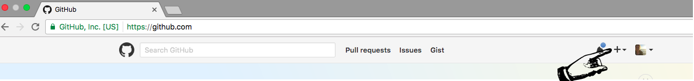

# Tutorial on Git & GitHub 5
## Author: [Yuxiao (Rain) Luo](https://github.com/YuxiaoLuo)

---
## Pushing to GitHub

Now, let's connect the directory you made to GitHub. GitHub is a service that allows us to host files, collaborate, and find the work of others. Once our syllabus is on GitHub, it will be publicly visible.

1. Go to GitHub in your browser and click the plus sign in the upper right hand corner.



2. After clicking the plus button, select `New repository` from the dropdown menu.

3. After clicking `New repository`, you'll have to enter some information, including a name and description for your repository.


- Choose a name, such as `git-practice`.
- Enter a description, such as `Test syllabus for learning Git and GitHub`.
- Keep the `Public — Anyone can see this repository` selector checked.
- Do *not* select `Initialize this repository with a README` since you will be importing an existing repository from your computer.
- Click `Create repository`.

You should end up inside your newly created git-practice repo. It will look like a set of instructions that you might want to use to connect your GitHub repository to a local repository.

The instructions we want consist of three lines underneath the heading `...or push an existing repository from the command line`. The arrow in this screenshot points to where these directions are on the page:


Copy out the first command and paste it in your terminal. It should look something like this:

```console
git remote add origin https://github.com/<username>/<repository-name>.git
```

You'll need the command copied from your new repo, since it will contain the correct URL.

Next, paste the second command. It will look exactly like this:

```console
git branch -M main
```

Finally, paste the third command. It will look exactly like this:

```console
git push -u origin main
```

If you have not used git before, you will need to authenticate with GitHub, and a window will pop up asking you to sign in. Click `Sign in with your browser`.

Your browser should open a window asking you to "Authorize Git Credential Manager." Click the green `Authorize GitCredentialManager` button:

You should see a message that authentication succeeded. If so, you may now close the browser window and return to the command line, where you should see output like this:

```console
Total 4 (delta 3), reused 0 (delta 0)
remote: Resolving deltas: 100% (3/3), completed with 3 local objects.
To github.com:<repo-name>/git.git
   916998f..9779fa7  master -> master
```

If you see output like this, go back to your new repository page in the browser and click the `Refresh` button. You should see your `syllabus.md` file on GitHub! Your git credentials are also now stored locally, so you should not need to authorize the credential manager again from that computer.


---

← [04-Staging and Committing Changes](week13_GitHubTutorial_4.md) &nbsp;&nbsp;&nbsp;

##### Note: this tutorial is largely accommodated from a [CUNY GCDI workshop](https://github.com/DHRI-Curriculum/git/blob/v2.0/sections/03-review-of-the-command-line.md). The author was a member of the organization.